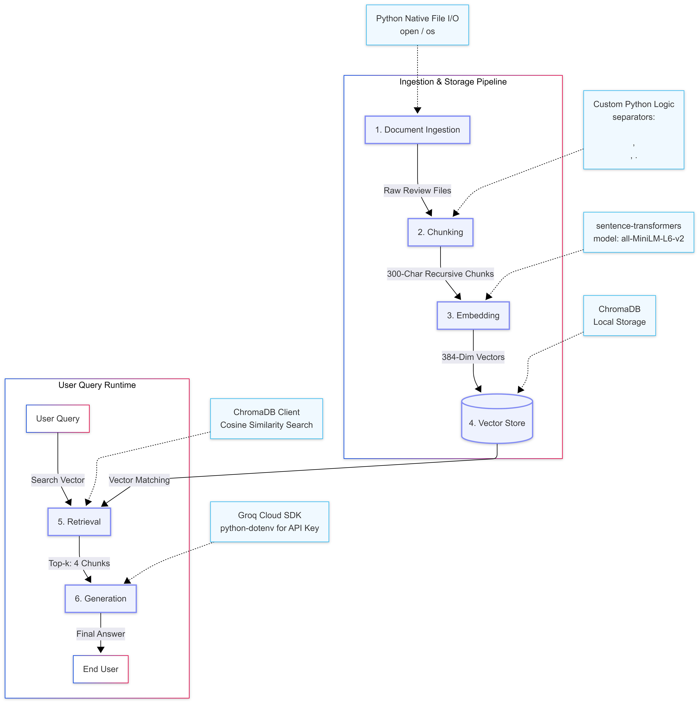

# Project 1 Planning: The Unofficial Guide

> Write this document before you write any pipeline code.
> Your spec and architecture diagram are what you'll use to direct AI tools (Claude, Copilot, etc.) to generate your implementation — the more specific they are, the more useful the generated code will be.
> Update the Retrieval Approach and Chunking Strategy sections if you change your approach during implementation.
> Update this file before starting any stretch features.

---

## Domain

<!-- What domain did you choose? Why is this knowledge valuable and hard to find through official channels? -->
Student reviews and survival guides for Computer Science professors and classes at Cal Poly Pomona.
---

## Documents

<!-- List your specific sources: URLs, subreddit names, forum threads, or file descriptions.
     Aim for at least 10 sources that together cover different subtopics or perspectives within your domain. -->

| # | Source | Type | URL or file path |
|---|--------|------|-----------------|
| 1 | Reddit (ACC 3110) | Discussion Thread | https://www.reddit.com/r/CalPolyPomona/comments/nslt98/acc_3110/ |
| 2 | RateMyProfessors (ID: 2687117) | Professor Review | https://www.ratemyprofessors.com/professor/2687117 |
| 3 | Reddit (Fuh Sang vs Dominick Atanasio) | Discussion Thread | https://www.reddit.com/r/CalPolyPomona/comments/7z786g/cs_professor_fuh_sang_or_dominick_atanasio/ |
| 4 | Reddit (CS 3310 w/ Salloum) | Discussion Thread | https://www.reddit.com/r/CalPolyPomona/comments/9r1haq/cs_3310_w_salloum/ |
| 5 | RateMyProfessors (ID: 2372423) | Professor Review | https://www.ratemyprofessors.com/professor/2372423 |
| 6 | RateMyProfessors (ID: 2647317) | Professor Review | https://www.ratemyprofessors.com/professor/2647317 |
| 7 | RateMyProfessors (ID: 2525429) | Professor Review | https://www.ratemyprofessors.com/professor/2525429 |
| 8 | RateMyProfessors (ID: 1548624) | Professor Review | https://www.ratemyprofessors.com/professor/1548624 |
| 9 | RateMyProfessors (ID: 2843849) | Professor Review | https://www.ratemyprofessors.com/professor/2843849 |
| 10 | RateMyProfessors (ID: 2517026) | Professor Review | https://www.ratemyprofessors.com/professor/2517026 |
| 11 | RateMyProfessors (ID: 126937) | Professor Review | https://www.ratemyprofessors.com/professor/126937 |
| 12 | RateMyProfessors (ID: 2322230) | Professor Review | https://www.ratemyprofessors.com/professor/2322230 |
| 13 | Reddit (Best/Underrated Study Places) | Discussion Thread | https://www.reddit.com/r/CalPolyPomona/comments/tnoob3/bestunderrated_place_to_study_at/ |
| 14 | RateMyProfessors (ID: 1822204) | Professor Review | https://www.ratemyprofessors.com/professor/1822204 |
| 15 | Reddit (College Orientation) | Discussion Thread | https://www.reddit.com/r/CalPolyPomona/comments/12wmfuj/college_orientation/ |
| 16 | Reddit (CS 2560 w/ Nguyen) | Discussion Thread | https://www.reddit.com/r/CalPolyPomona/comments/98faud/cs2560_c_programming_w_nguyen_should_i_drop/ |
| 17 | Reddit (CS Undergraduate Seminar) | Discussion Thread | https://www.reddit.com/r/CalPolyPomona/comments/i7a7aa/cs_undergraduate_seminar_class/ |
| 18 | RateMyProfessors (ID: 1030761) | Professor Review | https://www.ratemyprofessors.com/professor/1030761 |
| 19 | Reddit (CS Advice: Damavandi vs Sang) | Discussion Thread | https://www.reddit.com/r/CalPolyPomona/comments/bzvxz2/cs_advice_for_fall_damavandi_vs_sang/ |
| 20 | RateMyProfessors (ID: 901042) | Professor Review | https://www.ratemyprofessors.com/professor/901042 |
| 21 | Uloop (Fang Tang) | Professor Review | https://csupomona.uloop.com/professors/view.php/897658/Fang-Tang |
| 22 | Uloop (David Dear) | Professor Review | https://csupomona.uloop.com/professors/view.php/41864/David-Dear |
| 23 | Uloop (Craig Rich) | Professor Review | https://csupomona.uloop.com/professors/view.php/42420/Craig-Rich |
| 24 | Reddit (Fun Places to Eat/See Near CPP) | Discussion Thread | https://www.reddit.com/r/CalPolyPomona/comments/1jrzs8b/fun_place_to_eat_and_things_to_see_near_cpp/ |
| 25 | Reddit (Popular Eateries Near Campus) | Discussion Thread | https://www.reddit.com/r/CalPolyPomona/comments/1dmeekw/popular_eateries_places_to_go_onnear_campus/ |

---

## Chunking Strategy

<!-- How will you split documents into chunks?
     State your chunk size (in tokens or characters), overlap size, and explain why those
     numbers fit the structure of your documents.
     A review-heavy corpus warrants different chunking than a long FAQ. -->

**Chunk size: 300**

**Overlap: 30**

**Reasoning: I choose recursive strategy because my review can contain about 1 to 3 sentences.This strategy will not cut mid-word or mid-thoought**

---

## Retrieval Approach

<!-- Which embedding model are you using (e.g., all-MiniLM-L6-v2 via sentence-transformers)?
     How many chunks will you retrieve per query (top-k)?
     If you were deploying this for real users and cost wasn't a constraint, what tradeoffs
     would you weigh in choosing a different embedding model — context length, multilingual
     support, accuracy on domain-specific text, latency? -->

**Embedding model:** `all-MiniLM-L6-v2`

**Top-k:** 4

**Production tradeoff reflection:**
I would choose a moldel with a higher context length, accuracy , and domain-specifice text. A premium model would understand student slang better and make fewer mistakes finding files, even though its massive capacity is a bit of an overkill for my short reviews.

---

## Evaluation Plan

<!-- List your 5 test questions with their expected correct answers.
     Questions should be specific enough that you can judge whether the system's response
     is right or wrong. "What are good dining halls?" is too vague.
     "What do students say about wait times at [dining hall name] during lunch?" is testable. -->

| # | Question | Expected answer |
|---|----------|-----------------|
| 1 | What is considered the hardest core Computer Science course to pass at Cal Poly Pomona ? | CS 4310, CS 3110, CS 3110, CS 4310, CS 3650 |
| 2 | Which Computer Science professors do students recommend avoiding at Cal Poly  Pomona  ?  | Nima Davarpanah,Sallam Salloum, Nhi Nguyen ,Peter Laszlo |
| 3 | Who are considered the best Computer Science professors at Cal Poly Pomona to take algorithm and data structures ? | Crisrael Lucero,Markus Eger ,Yu Sun , Edwin Rodriguez|
| 4 | What is the best place to study on campus at Cal Poly Pomona according to students? | The University Library 6th Floor, Student Services Building Center Courtyard, The Cave (Building 97)|
| 5 | What are the best three off-campus dining places near Cal Poly Pomona based on top student reviews? | Koji Ramen, Pho 909, Sugar Rush Cafe |

### Retrieval Test Results

<!-- Ran each question above through retrieve() in embed.py (top-k = 4, cosine
     similarity on all-MiniLM-L6-v2). Scores are cosine similarity (0-1, higher
     = more similar). "Retrieval quality" judges whether the chunk that actually
     answers the question appeared in the top 4. -->

Run with `python eval_retrieval.py` (top-k = 4, cosine similarity).

| # | Question | Top hit (score) | Relevant chunk in top-4? | Retrieval quality |
|---|----------|-----------------|--------------------------|-------------------|
| 1 | Hardest core CS course | general-advice — Undergrad Seminar (0.666) | Yes — CS 3110 "one of the most challenging" at rank 2 (0.640) | Partially relevant |
| 2 | Professors to avoid | general-advice — "highly rated" professors (0.818) | Yes — "recommend avoiding: Tony Diaz, …" at rank 2 (0.727) | Partially relevant |
| 3 | Best profs for algorithms / data structures | general-advice — highly-rated profs incl. Yu Sun & Eger (0.746) | Partial — names Yu Sun/Eger; Fuh Sang & Yunsheng Wang follow | Partially relevant |
| 4 | Best place to study on campus | general-advice — Undergrad Seminar (0.636) | No — Library 6th Floor / SSB courtyard / The Cave did **not** make top-4; Farm Store did | Off-target |
| 5 | Best three off-campus dining places | off-campus-dinning — Farm Store (0.631) | No — retrieves Farm Store, Starbucks, Nambah Cafe; the top-3 (Koji Ramen, Pho 909, Sugar Rush) are absent | Partially relevant |

**Observations:**
- `general-advice.txt` dominates the top hits across every question — its
  summary-style sentences are densely on-topic and embed close to almost any
  CPP/CS query. This crowds out the more specific review chunks.
- **Q4 (study spots)** is a true retrieval miss: the answers live in
  `best-places.txt` (Library 6th-floor quiet zones, SSB courtyard, The Cave),
  but those chunks score below generic advice and the off-campus Farm Store. A
  shorter query ("best place to study on campus") *did* surface the library at
  rank 3–4, so the extra words ("at Cal Poly Pomona according to students")
  pulled the embedding toward generic campus text.
- **Q5 (off-campus dining)** is **partially relevant**: retrieval correctly
  lands in `off-campus-dinning.txt`, but returns the chunks that *mention*
  dining most generically (Farm Store, Starbucks, Nambah Cafe) rather than the
  three with the strongest student reviews (Koji Ramen, Pho 909, Sugar Rush).
  The embedding has no notion of "top-rated," so "best three based on top
  reviews" can't be answered by similarity alone — a candidate for the Failure
  Case Analysis in README.md.

---

## Anticipated Challenges

<!-- What could go wrong? Name at least two specific risks with reasoning.
     Consider: noisy or inconsistent documents, missing source attribution, off-topic
     retrieval, chunks that split key information across boundaries. -->

1. Incomplte reviews , chunks that would cut off critical information

2. Too many slang , ironic use of words, 

---

## Architecture

<!-- Draw a diagram of your pipeline showing the five stages:
     Document Ingestion → Chunking → Embedding + Vector Store → Retrieval → Generation
     Label each stage with the tool or library you're using.
     You can use ASCII art, a Mermaid diagram, or embed a sketch as an image.
     You'll use this diagram as context when prompting AI tools to implement each stage. -->

---

## AI Tool Plan

<!-- For each part of the pipeline below, describe:
     - Which AI tool you plan to use (Claude, Copilot, ChatGPT, etc.)
     - What you'll give it as input (which sections of this planning.md, which requirements)
     - What you expect it to produce
     - How you'll verify the output matches your spec

     "I'll use AI to help me code" is not a plan.
     "I'll give Claude my Chunking Strategy section and ask it to implement chunk_text()
     with my specified chunk size and overlap" is a plan. -->

**Milestone 3 — Ingestion and chunking:**

**Milestone 4 — Embedding and retrieval:**

**Milestone 5 — Generation and interface:**
